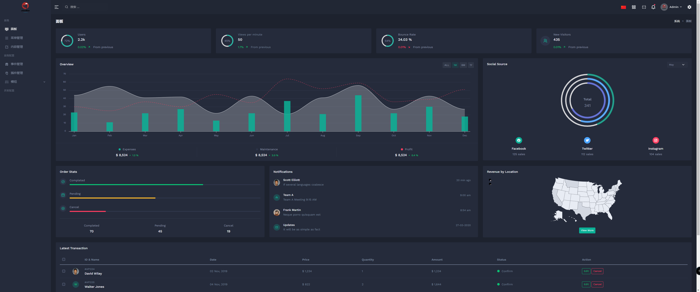
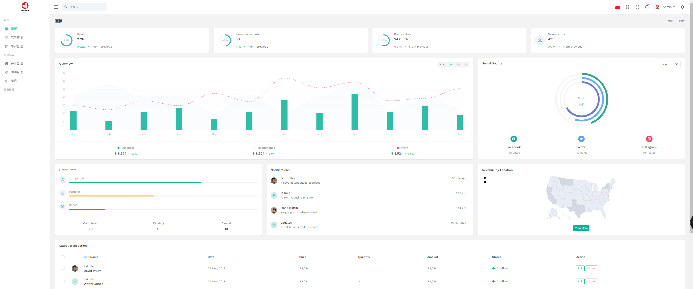

# WelineFramework

#### 介绍

微蓝WelineFramework框架！
~~~
├── app                 # 应用目录
│   ├── code            # -代码
│   ├── design          # -主题
│   ├── etc             # -配置
│   └── i18n            # -语言包
├── bin                 # 命令目录
├── dev                 # 开发目录
├── extend              # 拓展
├── generated           # 系统自动生成目录
│   ├── code            # -代码
│   ├── language        # -语言
│   └── routers         # -路由
├── pub                 # 公共
│   ├── errors          # -错误文件存放目录
│   ├── readme          # -关于
│   └── static          # -静态文件
├── setup               # 升级安装
│   ├── readme          # -关于
│   ├── static          # -升级安装时的静态目录
│   └── step            # -升级代码
├── var                 # 数据存放目录
│   ├── cache           # -缓存目录【仅文件缓存使用】
│   ├── log             # -日志目录
│   └── session         # -Session存放目录【仅文件session使用】
└── vendor              # Composer第三方拓展目录
~~~

测试环境：http://weline-framework-dev.aiweline.com/ 随时在开发测试，有可能会访问不了

黑白主题：
暗黑：

瓷白：

```markdown
    1、代码可移植性。
    代码可安装到其他同框架的项目中。一个代码应用目录位置位于项目下的app/code中。模块中可设置Api目录,Controller目录，view目录等以及必须的register.php注册文件。
    其中的每个应用可以移植安装。
    2、自定义ORM:
      1、Model开发模式下setup,首次安装install,可实现轻松对表进行修改操作，无需直接操作数据库；
      2、一个Model模型可以query查询，也可当做一个数据的对象;
      3、Orm兼容适配器模式，可以适配其他数据库。
    3、前后端集成到一个module中，做到一个需求一个module。
    4、代码模块化，接口以及传统路由分前后台。包括接口，具有后台接口入口，后台url入口。
    5、配置文件统一化。文件位置：app/etc/env.php
    6、Theme多主题继承模组Module文件。
    7、Module语言包目录i18n,以及全局语言包i18n。
    8、页面hook钩子。
    9、事件代码监听；
    10、插件方法环绕周期监听；
    11、Block模板组件化；
    12、Taglib标签，可实现代码标签化。
    13、预编译模板引擎。
    14、setup目录实现首次安装执行逻辑。
    15、Console目录命令行简单定义，只需继承CommandInterface即可，目录路径既是命令行识别路径。
```

#### 软件架构

    PHP>=8.0
    composer
    nginx/apache

#### 安装教程
###一、项目安装

    1.  WEB项目部署
    2.  无需设置繁杂的nginx（项目中有样例设置，include到配置中就可以）或者Apache设置（针对Apache项目中编写有伪静态），仅设置项目目录为部署目录即可。

###二、框架命令

    1.  模块安装命令 bin/m module:upgrade 此命令更新安装模块，以及模块数据。（将执行模块中的Setup\Install.php卸载脚本）
    2.  模块安装命令 bin/m module:disable <module_name> 此命令更新安装模块，以及模块数据。（将执行模块中的Setup\Install.php卸载脚本）
    3.  模块卸载命令 bin/m module:remove <module_name> 此命令备份模块并删除模块。（将执行模块中的Setup\Remove.php卸载脚本）
    4.  其他命令 php bin/m 回车可见

#### 使用说明

    1.  框架可快速实现Rest Api,前后端。
    2.  后期会自带开发文档模块。
    
    
#### 更新说明

# 1.0.1
```markdown
1. 更新I18n国际化__()函数收集并在模块（可指定模块）生成翻译（可指定要翻译的语言）语言翻译文件。
2. 需新增IP封锁系统，框架Security模块在框架入口处封死机器IP.
3. 使用加入less对css进行编译。
4. i18n国际化翻译。
5. 事件管理可直接传非对象常值，无需构建对象（完成事件Wrapper）。
6. 新增主题静态文件继承功能。
7. 开发模式模型（Model）字段顺序映射到数据库。
8. 全页缓存：将一个路由映射的页面缓存，无需每次解析组件进行映射（通俗就是将各个模板进行合并成一个完整页面文件进行缓存）。
9. 增加后台管理界面；
10. 设计资源权限管理系统；
11. 使用加入less对css进行编译。
12. 静态资源编译,减少服务器可执行代码量，增加性能。（处理中...）
13. 配置xml化
14. 新增事件观察者机制（event.xml)
15. 新增命令简化机制.
16. 框架缓存系统完成！
17. 事件Event观察者Observer模式
18. 插件机制
19. 完成主题功能
20. 完成i18n翻译功能
21. 对象缓存
22. 新增工厂类模式
```
#### 参与贡献

如果你和我一样喜欢自由代码，可联系参与！ Oh~~

1.  Fork 本仓库
2.  新建 Feat_xxx 分支
3.  提交代码
4.  新建 Pull Request

